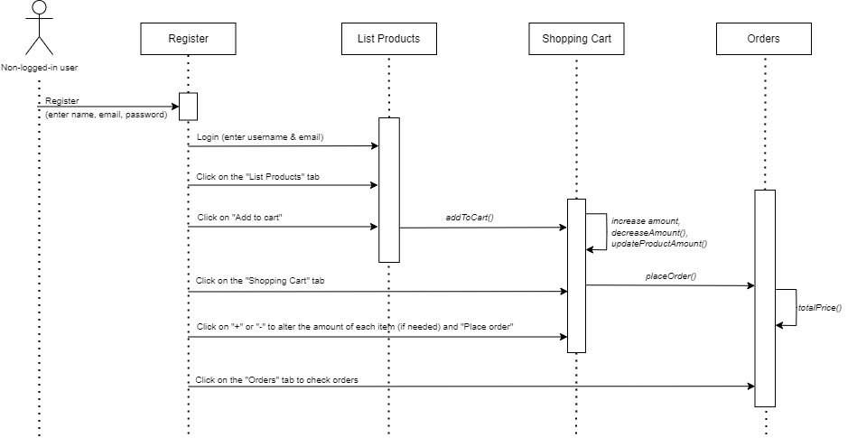
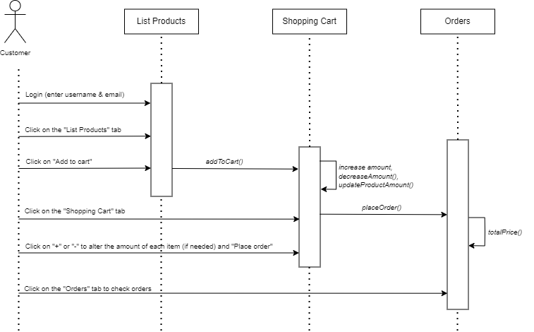
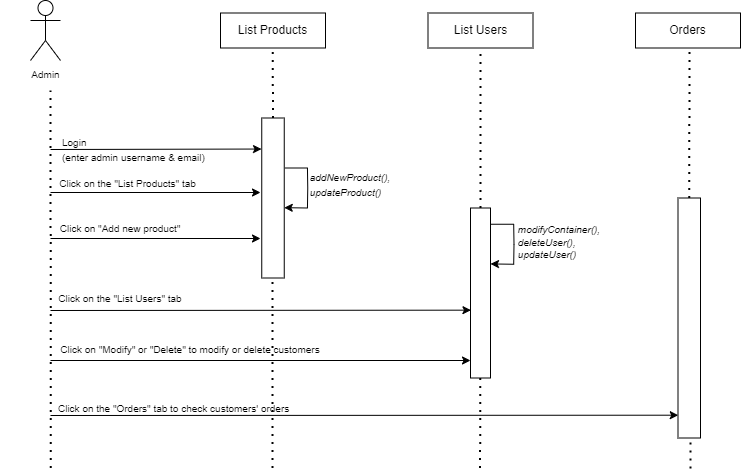
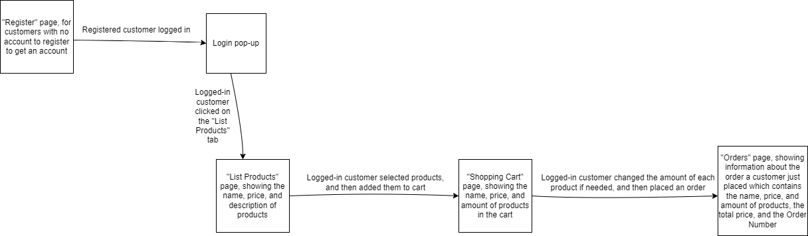
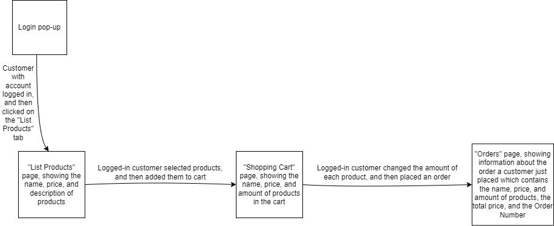
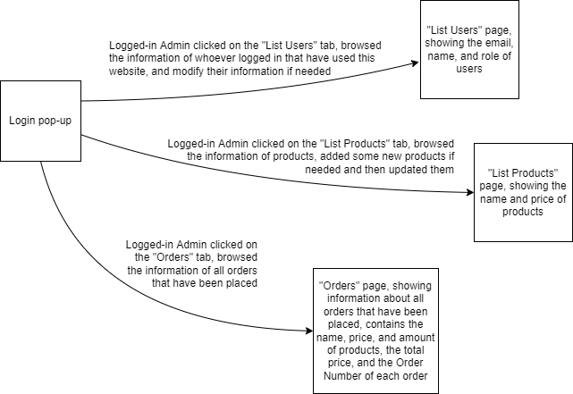

# Group

We are a group of three members.

- Member 1:  Anh Pham, 50357871, anh.pham@tuni.fi, resposible for: backend (server), code refactoring (eslint, jsdoc...), documentation (second part)

- Member 2:  Chu Duc Anh, 50358922, anh.chu@tuni.fi, resposible for: API and data models, gitLab issues & mocha tests

- Member 3:  Hui Yin, 150163114, hui.yin@tuni.fi, resposible for: client (UI), documentation (first part)

# Website instruction

- URL: <https://obscure-ocean-24122.herokuapp.com/>. You can login by navigate to the ```List Users``` page.

- Login credentials:

  * Customer:
        username: customer@email.com
        password: 0987654321
  * Admin:
        username: admin@email.com
        password: 1234567890

# Project structure

The structure and components of our Node app <https://obscure-ocean-24122.herokuapp.com/> :

- index: It defines the http server.
- routes: It defines different endpoints, handles http requests, directs requests to the correct locations.
- models: They are all data models that model different entities in the app.
- controllers: They handle the logic of data models.
- utils: It is a collection of tools and help functions.
- auth: It is for authentication.
- public: It covers the frontend of the app which includes html, css, and js, to handle the functionality in the frontend and make requests to API.

The UML diagrams below showcase the structure in detail.

## 1. UML sequence diagram (Non-logged-in user)



## 2. UML sequence diagram (Customer)



## 3. UML sequence diagram (Administrator)



# Pages and navigation

The pages and navigation is depicted in the diagrams below.

## 1. Non-logged-in user



## 2. Customer



## 3. Administrator



# Data models

The data models are User, Product, and Order.

1. Attributes and types of each data model:

    - User: name, email, password, role.

    - Product: name, price, image, description.

    - Order: customerId (which is shown as Order Number that is unique to every placed order) and items (in which we have attributes like "product" and "quality").

2. A description of the purpose of these models: To model a user, to model a product which has certain attributes so we can track what a customer has bought, and to model an order which has a unique Order Number for tracking.

3. Connections to other models: A user can select 1 to n products to place an order, and an order lists 1 to n products.

## Tests and documentation

We only created a few test cases, mainly for handling requests. The tests provided by the course are already very comprehensive. All of these test cases are included in the directory ```test/gitLabIssues.test.js```
The issues addressed in the file corresponds to the GitLab issue board of our projects, which can be found with the ```bug``` label at:
```https://course-gitlab.tuni.fi/webdev1-spring-2022/webdev-group24/-/issues```

## Security concerns

This website might be vulnerable to different security issues. Below are some of such issues, as well as our solution to prevent them.

1. Brute force attack: The hacker can try to login with admin credential by guessing the password. We prevent this by using password encryption, as well as requiring the length of the password to be at least 10 so that the hacker has a lower chance of guessing the actual password.

2. SQL injection (application database hijacking), XSS (writing scripts to any form), and data injection (gives unauthorized instructions). All these injection attacks can lead to data leaking and database removal. Our solution is to stringify all user inputs and request body.
